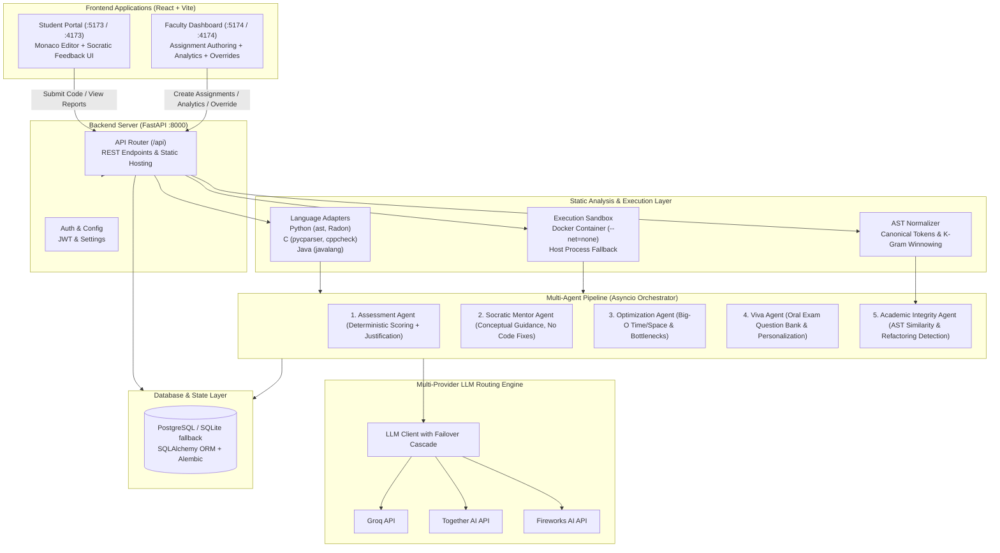
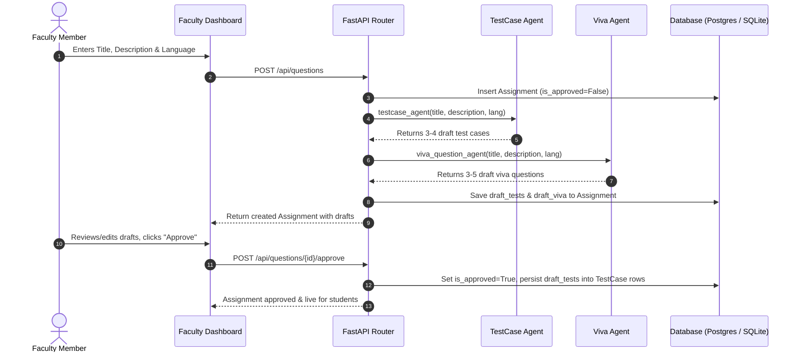
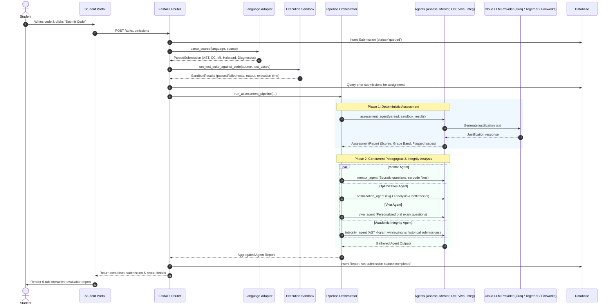
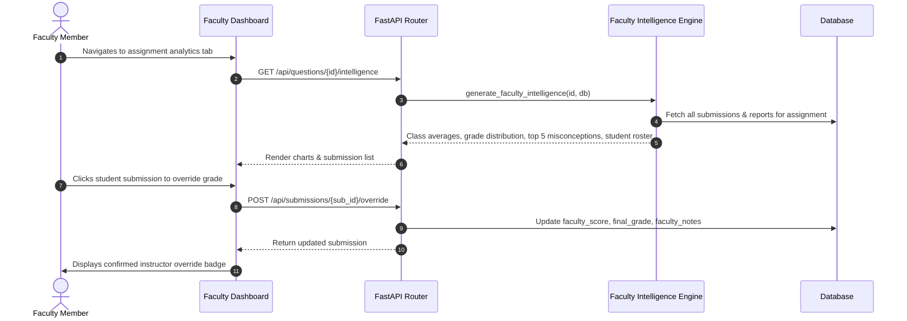

# CodeMentor AI: System Architecture, File Structure & Module Guide

> **Project Title**: CODEMENTOR AI: A Multi-Agent AI Framework for Automated Programming Assessment and Personalized Educational Feedback  
> **Author**: Vijil Raj (TCR25MCA-2057, GEC Thrissur)  
> **Target Stack**: FastAPI (Python 3.10+), React (JS ES6+ / Vite), PostgreSQL / SQLite, Docker Sandbox, Multi-Agent LLM Infrastructure (Together AI / Fireworks AI / Groq serving DeepSeek-Coder, Qwen2.5-Coder, Code Llama).

---

## 1. High-Level Architecture Overview

CodeMentor AI is an automated programming assessment and pedagogical guidance system. It combines static code analysis, language-specific AST parsing, sandboxed execution, and an asynchronous multi-agent LLM pipeline to deliver deterministic evaluation and Socratic feedback.



---

## 2. Complete Repository Directory Tree

Below is the directory structure of the repository:

```text
CodeMentor_AI/
├── .env.example                     # Sample environment configuration file
├── .env                             # Active environment variable settings
├── .dockerignore                    # Docker build ignore rules
├── .gitignore                       # Git repository ignore rules
├── .gitattributes                   # Line endings and git attributes
├── README.md                        # High-level overview & quickstart
├── RUNNING_INSTRUCTIONS.md          # Step-by-step local & containerized run guide
├── REMAINING_WORK.md                # Presentation module verification & compliance summary
├── PLAN_ASSESSMENT_AGENT.md         # Architecture blueprint for Assessment Agent
├── PLAN_MENTOR_AGENT.md             # Architecture blueprint for Socratic Mentor Agent
├── PROJECT_STRUCTURE_AND_MODULES.md # (This document) Complete module guide
├── docker-compose.yml               # Development multi-container orchestration
├── docker-compose.prod.yml          # Production multi-container orchestration
├── run.ps1                          # Single-command Windows startup script
├── run.sh                           # Single-command Linux/macOS startup script
├── reset_data.ps1                   # Windows database and assignment reset script
├── reset_data.sh                    # Linux/macOS database and assignment reset script
├── codementor.db                    # Local SQLite database file (fallback storage)
├── alembic.ini                      # Alembic database migration configuration
│
├── alembic/                         # Database migrations
│   ├── env.py                       # Alembic environment runner & model loader
│   └── versions/                    # Versioned database migration scripts
│       └── 001_initial_schema.py    # Initial tables DDL (users, assignments, submissions, etc.)
│
├── backend/                         # Core Python FastAPI Application
│   ├── Dockerfile                   # Backend container definition
│   ├── requirements.txt             # Python runtime dependencies
│   ├── main.py                      # FastAPI application entrypoint & static mount
│   ├── reset_db.py                  # Standalone Python script to wipe/reseed database
│   ├── test_live_system.py          # End-to-end integration test of complete user workflow
│   │
│   ├── adapters/                    # Language-Specific Parsing & Metric Extraction
│   │   ├── __init__.py              # Package export
│   │   ├── python_adapter.py        # Python AST walker & Radon complexity analyzer
│   │   ├── c_adapter.py             # C preprocessing, pycparser AST & cppcheck linter
│   │   ├── java_adapter.py          # Java AST parsing via javalang & Halstead metrics
│   │   └── test_adapters.py         # Unit tests for C, Java, and Python adapters (8 tests)
│   │
│   ├── agents/                      # Multi-Agent Assessment & Pedagogical System
│   │   ├── __init__.py              # Package exports
│   │   ├── schemas.py               # Pydantic schemas for all agent reports & data models
│   │   ├── assessment_agent.py      # Deterministic scoring (Correctness, Standards, Efficiency)
│   │   ├── mentor_agent.py          # Socratic pedagogical hints & concept detection
│   │   ├── optimization_agent.py    # Big-O time/space complexity & bottleneck analysis
│   │   ├── viva_agent.py            # Draft viva generation & submission-time question selector
│   │   ├── testcase_agent.py        # Automated test case generation for question setup
│   │   ├── faculty_intelligence.py  # Class-level analytics & misconception aggregation
│   │   ├── test_assessment_agent.py # Comprehensive tests for Assessment Agent (32 tests)
│   │   ├── test_mentor_agent.py     # Tests for Socratic Mentor Agent (10 tests)
│   │   ├── test_integrity_agent.py  # Tests for Academic Integrity Agent (3 tests)
│   │   └── test_phase3_agents.py    # Tests for Optimization, Viva, and TestCase agents (6 tests)
│   │
│   ├── api/                         # REST API Routing & Schemas
│   │   ├── __init__.py              # Package exports
│   │   ├── routes.py                # FastAPI route controllers for all endpoints
│   │   ├── schemas.py               # Pydantic request & response schemas for API
│   │   ├── test_question_flow.py    # Tests for question creation, draft tests, and approval
│   │   ├── test_faculty_intelligence.py # Tests for faculty analytics & misconception engine
│   │   └── test_delete_and_reset_endpoints.py # Tests for delete and reset endpoints
│   │
│   ├── core/                        # Shared Core Utilities & LLM Routing
│   │   ├── __init__.py              # Package exports
│   │   ├── config.py                # BaseSettings configuration loaded from .env
│   │   ├── auth.py                  # JWT creation, token verification & password hashing
│   │   ├── schemas.py               # Shared core domain schemas (ParsedSubmission, Diagnostics)
│   │   ├── ast_normalizer.py        # Identifier stripping, k-gram generation, AST winnowing
│   │   ├── llm_client.py            # Multi-provider LLM client (Groq, Together, Fireworks)
│   │   └── test_llm_client.py       # Tests for LLM failover, JSON extraction & aliases (4 tests)
│   │
│   ├── db/                          # Database Layer & Session Management
│   │   ├── __init__.py              # Package exports
│   │   ├── models.py                # SQLAlchemy ORM database models
│   │   ├── session.py               # Database engine, connection pooling & session factory
│   │   └── test_db_readiness.py     # Tests for database connectivity & pooling (3 tests)
│   │
│   ├── orchestrator/                # Pipeline Orchestration
│   │   ├── __init__.py              # Package exports
│   │   ├── orchestrator.py          # Asynchronous multi-agent execution pipeline
│   │   └── test_orchestrator.py     # Tests for pipeline concurrency and error handling (4 tests)
│   │
│   └── sandbox/                     # Sandboxed Code Execution
│       ├── Dockerfile               # Execution sandbox container definition
│       ├── sandbox_runner.py        # Docker-based and host-fallback code runner
│       ├── test_suite_runner.py     # Test suite evaluator against DB test cases
│       ├── test_sandbox.py          # Tests for sandbox isolation, timeouts, and compilers (5 tests)
│       └── test_testsuite_runner.py # Tests for test suite execution and output normalization (3 tests)
│
└── frontend/                        # Web User Interfaces
    ├── Dockerfile                   # Multi-stage frontend container build definition
    ├── package.json                 # Top-level workspace script configurations
    │
    ├── student-portal/              # React Student Application
    │   ├── Dockerfile               # Student portal production container definition
    │   ├── package.json             # Dependencies (React 18, Monaco Editor, Lucide icons)
    │   ├── vite.config.js           # Vite development server configuration (Port 5173 / 4173)
    │   ├── index.html               # Single Page Application HTML root
    │   └── src/
    │       ├── main.jsx             # React DOM root mounting script
    │       ├── App.jsx              # Complete Student Portal UI (Monaco editor + 6-tab report)
    │       └── index.css            # Dark-mode design system & animations
    │
    └── faculty-dashboard/           # React Faculty Application
        ├── Dockerfile               # Faculty dashboard production container definition
        ├── package.json             # Dependencies (React 18, Lucide icons, Vite)
        ├── vite.config.js           # Vite development server configuration (Port 5174 / 4174)
        ├── index.html               # Single Page Application HTML root
        └── src/
            ├── main.jsx             # React DOM root mounting script
            ├── App.jsx              # Complete Faculty Dashboard UI (Authoring, Analytics, Overrides)
            └── index.css            # Dark-mode design system & animations
```

---

## 3. Working of Each Module (Deep Dive)

### 3.1. Language Adapters (`backend/adapters`)

The adapters module converts raw source code in Python, C, or Java into a standardized `ParsedSubmission` structure containing AST metadata, complexity metrics, and static analysis diagnostics.

#### A. Python Adapter ([python_adapter.py](file:///d:/mca_mini_vijil/CodeMentor_AI/backend/adapters/python_adapter.py))
- **Parser**: Standard Python `ast` module.
- **AST Traversal**: Counts total nodes, functions (`ast.FunctionDef`, `ast.AsyncFunctionDef`), classes (`ast.ClassDef`), and extracted `import` statements.
- **Complexity Analysis**: Uses `radon` (when installed):
  - `cc_visit`: Cyclomatic Complexity calculation and categorization into letter ranks (`A` to `F`).
  - `mi_visit`: Maintainability Index (0–100 scale).
  - `h_visit`: Halstead volume metric computation.
- **Diagnostics**: Catches `SyntaxError` and outputs standardized `Diagnostic` items with line/column numbers.

#### B. C Adapter ([c_adapter.py](file:///d:/mca_mini_vijil/CodeMentor_AI/backend/adapters/c_adapter.py))
- **Parser**: `pycparser` with AST visitor `CASTVisitor`.
- **Preprocessor Normalization**: Strips preprocessor directives (`#include`, `#define`, `#pragma`) and comments, then injects standard C typedef stubs (`size_t`, `bool`, `printf`, `malloc`, `free`, etc.) so `pycparser` can construct an AST without needing system headers.
- **Snippet Fallback**: If standard parsing fails (e.g. a code snippet without `main`), automatically wraps statements inside a synthetic `int main() { ... }` block and re-attempts parsing.
- **Metrics Calculation**:
  - Cyclomatic Complexity: Decisions counted across `If`, `For`, `While`, `DoWhile`, `Switch`, `Case`, and logical operators `&&`, `||`.
  - Maintainability Index: Approximated via $100.0 - (CC \times 3.5) - (\ln(\max(\text{LOC}, 1)) \times 6.0)$.
  - Halstead Volume: Approximated using AST node vocabulary and length.
- **Static Analysis & Security Diagnostics**:
  - Executes `cppcheck` with `--enable=all` if installed on the host.
  - Built-in static heuristics detect dangerous functions (e.g., `gets()` buffer overflow risks) and memory leaks (`malloc()` without a corresponding `free()`).

#### C. Java Adapter ([java_adapter.py](file:///d:/mca_mini_vijil/CodeMentor_AI/backend/adapters/java_adapter.py))
- **Parser**: `javalang` library.
- **Snippet Wrapping**: If raw compilation unit parsing fails (e.g. methods submitted without an enclosing class), wraps code inside `public class _CodeWrapper { ... }`.
- **AST Metrics**:
  - Traverses `javalang.tree.MethodDeclaration`, `ClassDeclaration`, and `imports`.
  - Decision counting across `IfStatement`, `ForStatement`, `WhileStatement`, `DoStatement`, `CatchClause`, `SwitchStatementCase`, `TernaryExpression`, and binary `&&`, `||`.
  - Computes Halstead Volume from unique operators (binary operations) and operands (literals, member references).
  - Calculates Maintainability Index and assigns letter ranks `A`–`F`.
- **Diagnostics**: Converts `javalang.parser.JavaSyntaxError` into structured `Diagnostic` items.

---

### 3.2. Secure Sandbox & Execution Runner (`backend/sandbox`)

The sandbox provides safe execution of untrusted student code against test suites without risking system integrity or network exfiltration.

#### A. Sandbox Runner ([sandbox_runner.py](file:///d:/mca_mini_vijil/CodeMentor_AI/backend/sandbox/sandbox_runner.py))
- **Isolation Modes**:
  1. **Docker Container Sandbox**: If `USE_DOCKER_SANDBOX=1` and Docker is available, runs execution inside an isolated container with `--net=none` (network disabled), CPU limits (`--cpus=1.0`), memory constraints (`--memory=256m`), and non-root execution.
  2. **Safe Host Process Fallback**: Executes in isolated temporary directories with strict subprocess timeouts (`SANDBOX_TIMEOUT_SECONDS`, default 10s) and non-zero exit code capture.
- **Output Guardrails**: Truncates output to `MAX_OUTPUT_BYTES = 64KB` to prevent denial-of-service via infinite print loops.
- **Execution Lifecycle by Language**:
  - **Python**: Injects an execution harness (`_prepare_python_script`) handling safe standard input (catching `EOFError`) and automatically executing top-level functions with literal evaluation when arguments are passed.
  - **C**: Compiles with `gcc` / `clang` using `-O2` to a temporary executable binary, verifies compile success, and executes with stdin piping.
  - **Java**: Extracts public class name or defaults to `Main`, compiles with `javac`, and runs with `java -cp . <ClassName>`.
- **Status Classification**: Distinguishes `success`, `compile_error`, `runtime_error`, and `timeout`.

#### B. Test Suite Runner ([test_suite_runner.py](file:///d:/mca_mini_vijil/CodeMentor_AI/backend/sandbox/test_suite_runner.py))
- Function: `run_test_suite_against_code(...)`.
- Iterates over all active `TestCase` records for an assignment.
- Pipes test input to the sandbox and compares actual standard output against expected output using whitespace/newline normalization.
- **Short-circuiting**: If a compilation error occurs on test 1, halts subsequent test executions immediately and flags the compile error.

---

### 3.3. Multi-Agent Assessment & Intelligence System (`backend/agents`)

The agent subsystem employs specialized agents that evaluate code deterministically and provide natural language educational feedback.

```text
Student Submission
       │
       ▼
[Assessment Agent] ────────► Correctness (0-100), Standards (0-100), Efficiency (0-100)
       │                    Overall Grade Band (excellent / good / fair / needs_improvement)
       │                    Flagged Issues & Failed Test Cases
       │
       ├───────────────────────────────┬───────────────────────────────┬───────────────────────────────┐
       ▼                               ▼                               ▼                               ▼
[Socratic Mentor Agent]      [Optimization Agent]               [Viva Agent]              [Academic Integrity Agent]
- Growth Mindset Message     - Big-O Time & Space              - Oral Exam Questions      - AST Canonical Tokenization
- Socratic Hints (No Code)   - Loop Nesting & Bottlenecks      - Personalization Reasons   - 4-Gram Winnowing Hash
- Conceptual Reading List    - Memory & String Inefficiencies  - Faculty Grading Guide    - Jaccard Similarity Score
- AST Concept Detection                                                                   - Refactoring Detection
```

#### A. Assessment Agent ([assessment_agent.py](file:///d:/mca_mini_vijil/CodeMentor_AI/backend/agents/assessment_agent.py))
- **Input**: `ParsedSubmission` + `SandboxResults`.
- **Deterministic Scoring Rules**:
  - **Correctness Score**: $\text{Correctness} = \left(\frac{\text{passed\_tests}}{\text{total\_tests}}\right) \times 100$.
  - **Standards Score**: Starts at 100, penalized by static analysis diagnostics:
    - Error: $-5.0$ pts
    - Warning: $-2.0$ pts
    - Info: $-0.5$ pts
    - High Cyclomatic Complexity ($CC > 10$): $-2.0$ pts
  - **Efficiency Score**: 50/50 weighted combination:
    - Cyclomatic Complexity Band ($CC \le 5 \to 100$, $6\text{--}10 \to 90$, $11\text{--}15 \to 70$, $16\text{--}20 \to 40$, $>20 \to 0$).
    - Maintainability Index ($0\text{--}100$).
  - **Overall Recommendation**:
    - $\ge 90$: `excellent`
    - $\ge 75$: `good`
    - $\ge 60$: `fair`
    - $< 60$: `needs_improvement`
- **Narrative Justification**: Generates a justification using the LLM client, with deterministic fallbacks when API keys are absent.

#### B. Socratic Mentor Agent ([mentor_agent.py](file:///d:/mca_mini_vijil/CodeMentor_AI/backend/agents/mentor_agent.py))
- **Pedagogical Policy**: **Strictly forbids giving away direct code solutions or copy-paste code fixes**.
- **Failure Categorization**: Classifies test and static failures into pedagogical categories: `boundary_conditions`, `logic_error`, `performance_issue`, `style_issue`, `complexity`.
- **AST Concept Detection**: Identifies language features in student code (e.g., list comprehensions, recursion, loops, classes, lambda functions, dictionary lookups).
- **Output (`MentorReport`)**:
  - `overall_encouragement`: Growth-mindset narrative.
  - `hints`: List of `MentorHint` objects (topic, Socratic guiding question, concept to review). Deduplicated and capped at 5 hints.
  - `suggested_reading`: Curated reading topics.
  - `concepts_detected`: Detected constructs with AST evidence.

#### C. Optimization Agent ([optimization_agent.py](file:///d:/mca_mini_vijil/CodeMentor_AI/backend/agents/optimization_agent.py))
- **Big-O Analysis**:
  - Time Complexity: Analyzes loop nesting levels ($O(1), O(n), O(n^2), O(n^3)$) and recursion patterns.
  - Space Complexity: Detects dynamic memory allocation and container usage ($O(1)$ vs $O(n)$).
- **Bottleneck Detection**:
  - Nested loops on large collections.
  - Quadratic string concatenation inside loops (`+=` on strings in loops).
  - Redundant repeated lookups / conversions.
- **Output (`OptimizationReport`)**: Time complexity, space complexity, specific line findings, and high-level algorithmic refactoring guidance.

#### D. Academic Integrity Agent ([integrity_agent.py](file:///d:/mca_mini_vijil/CodeMentor_AI/backend/agents/integrity_agent.py))
- **Mechanism**:
  - Uses `backend/core/ast_normalizer.py` to strip variable names, literal values, docstrings, and comments, producing canonical AST structural tokens.
  - Generates 4-gram winnowing hashes for every submission.
  - Computes Jaccard similarity between current submission $K$-grams and all historical submissions for that assignment:
    $$\text{Jaccard Similarity} = \frac{|K_{\text{current}} \cap K_{\text{historical}}|}{|K_{\text{current}} \cup K_{\text{historical}}|} \times 100$$
- **Refactoring Detection**:
  - *Identifier Renaming*: High AST similarity combined with low surface text similarity indicates variable renaming/obfuscation.
  - *Control Flow Equivalence*: Matching loop depth and decision structures.
- **Risk Classification**:
  - $< 35\%$: `low`
  - $35\% \le \text{Score} \le 70\%$: `moderate`
  - $> 70\%$: `high`
- **Output (`IntegrityReport`)**: Risk level, top matches, refactoring patterns detected, and explainable summary.

#### E. Viva Agent ([viva_agent.py](file:///d:/mca_mini_vijil/CodeMentor_AI/backend/agents/viva_agent.py))
- **Dual Role**:
  1. `viva_question_agent` (Question-Setup Time): Generates 3–5 conceptual oral examination questions with expected concepts and sample answers for the assignment's draft question bank.
  2. `viva_agent` (Submission Time): Inspects the student's submission (CC, function count, recursion, data structures used) and selects/personalizes relevant oral viva questions from the approved bank, with grading guidance for the examiner.

#### F. TestCase Agent ([testcase_agent.py](file:///d:/mca_mini_vijil/CodeMentor_AI/backend/agents/testcase_agent.py))
- Generates candidate test cases during assignment creation.
- Produces a mix of standard input/output cases, edge cases (empty collections, boundary values), and hidden evaluation cases.
- Provides fallback test cases when operating without active LLM API credentials.

#### G. Faculty Intelligence Engine ([faculty_intelligence.py](file:///d:/mca_mini_vijil/CodeMentor_AI/backend/agents/faculty_intelligence.py))
- Aggregates submissions for an assignment.
- Computes class-wide averages for Correctness, Standards, and Efficiency.
- Computes grade distribution histograms (`excellent`, `good`, `fair`, `needs_improvement`).
- **Misconception Mining**: Aggregates flagged code issues and Socratic hint topics across all submissions to identify the top 5 recurring class misconceptions with affected student counts and percentages.
- Compiles consolidated student submission rosters with integrity risk indicators and manual grade override status.

---

### 3.4. Orchestrator Pipeline (`backend/orchestrator`)

#### Orchestrator ([orchestrator.py](file:///d:/mca_mini_vijil/CodeMentor_AI/backend/orchestrator/orchestrator.py))
- Manages the submission assessment pipeline:
  1. **Sequential Execution**: Runs `assessment_agent` first to establish deterministic correctness, standards, and efficiency scores, plus failed tests and flagged issues.
  2. **Concurrent Execution**: Executes `mentor_agent`, `optimization_agent`, `viva_agent`, and `integrity_agent` concurrently via `asyncio.gather`.
- **Fault Tolerance**: Wraps each agent execution in `_run_agent_safe`. If any single agent encounters an exception, it logs the error and returns a fallback `AgentOutput` without halting the rest of the pipeline.

---

### 3.5. Core Services & Cloud LLM Routing (`backend/core`)

#### A. Multi-Provider LLM Client ([llm_client.py](file:///d:/mca_mini_vijil/CodeMentor_AI/backend/core/llm_client.py))
- **Unified Interface**: Supports Groq, Together AI, Fireworks AI, and OpenAI.
- **Model Aliasing**: Automatically maps friendly aliases (`deepseek-coder`, `qwen2.5-coder`, `code-llama`) to exact vendor-hosted model identifiers:
  - Together AI: `Qwen/Qwen2.5-Coder-32B-Instruct`, `deepseek-ai/DeepSeek-Coder-V2-Instruct`, `codellama/CodeLlama-34b-Instruct-hf`
  - Fireworks AI: `accounts/fireworks/models/qwen2.5-coder-32b-instruct`
  - Groq: `qwen/qwen3.8-27b`, `llama-3.3-70b-versatile`
- **Failover Cascade**: If the primary provider fails (e.g. rate limits or missing keys), iterates through configured fallback providers.
- **Robust JSON Parser**: `_extract_json_from_text` parses raw JSON, strips markdown ```` ```json ```` fences, and extracts embedded JSON objects.
- **Specialized Per-Agent Overrides**: `get_agent_llm_client(agent_name)` allows assigning distinct models or providers to individual agents (e.g., `MENTOR_AGENT_MODEL`, `ASSESSMENT_AGENT_PROVIDER`).

#### B. AST Normalizer ([ast_normalizer.py](file:///d:/mca_mini_vijil/CodeMentor_AI/backend/core/ast_normalizer.py))
- Strips variable names, literal numbers/strings, comments, and docstrings.
- Converts code into canonical AST token streams.
- Computes 4-gram sliding window hashes and SHA256 structural fingerprints for plagiarism and structural similarity detection.

#### C. Settings & Security ([config.py](file:///d:/mca_mini_vijil/CodeMentor_AI/backend/core/config.py), [auth.py](file:///d:/mca_mini_vijil/CodeMentor_AI/backend/core/auth.py))
- `config.py`: Pydantic `BaseSettings` reading environment variables from `.env`.
- `auth.py`: Provides JWT encoding/decoding and bcrypt password verification.

---

### 3.6. Database Layer & Migrations (`backend/db` & `alembic`)

#### A. Data Models ([models.py](file:///d:/mca_mini_vijil/CodeMentor_AI/backend/db/models.py))
- **`User`**: ID, email, hashed password, role (`student` or `faculty`).
- **`Assignment`**: ID, title, description, language (`python`, `c`, `java`), `is_approved`, `draft_tests` (JSON), `draft_viva` (JSON), timestamps.
- **`TestCase`**: ID, foreign key to assignment, `input_data`, `expected_output`, `active` flag.
- **`VivaQuestion`**: ID, foreign key to assignment, `prompt`, `expected_concepts` (JSON).
- **`Submission`**: ID, foreign keys to assignment and student user, `source_code`, `language`, `status` (`queued`, `completed`), `faculty_score`, `final_grade`, `faculty_notes`.
- **`Report`**: ID, foreign key to submission, `aggregated_output` (complete JSON containing all agent reports).

#### B. Connection & Session Management ([session.py](file:///d:/mca_mini_vijil/CodeMentor_AI/backend/db/session.py))
- Supports PostgreSQL with connection pooling (`pool_pre_ping=True`, `pool_size=10`).
- **Automatic Fallback**: If PostgreSQL is unreachable, falls back to local SQLite storage (`codementor.db`) so the application remains operable in offline or development environments.

#### C. Database Migrations ([alembic/](file:///d:/mca_mini_vijil/CodeMentor_AI/alembic/))
- Configured via `alembic.ini` and `alembic/env.py`.
- Migration `001_initial_schema.py` defines DDL operations for creating and rolling back all 6 core tables.

---

### 3.7. API Routing Layer (`backend/api` & `backend/main.py`)

#### Routes ([routes.py](file:///d:/mca_mini_vijil/CodeMentor_AI/backend/api/routes.py))
| Endpoint | Method | Description |
| :--- | :---: | :--- |
| `/api/questions` | `GET` | List all assignments/questions |
| `/api/questions` | `POST` | Create a question; triggers TestCase Agent & Viva Agent to generate draft tests/viva bank |
| `/api/questions/{id}` | `GET` | Retrieve assignment details by ID |
| `/api/questions/{id}` | `PUT` | Update assignment details or draft questions |
| `/api/questions/{id}/approve` | `POST` | Approve question; promotes draft tests into active `TestCase` records |
| `/api/questions/{id}` | `DELETE` | Delete assignment and cascade-delete submissions, test cases, and reports |
| `/api/submissions` | `POST` | Submit student code; runs sandbox test execution & multi-agent assessment pipeline |
| `/api/submissions/{id}/status` | `GET` | Retrieve submission status and aggregated multi-agent report |
| `/api/reports/{id}` | `GET` | Retrieve full assessment report by ID |
| `/api/questions/{id}/intelligence` | `GET` | Class-level analytics, misconception frequency & student summary |
| `/api/submissions/{id}/override` | `POST` | Faculty grade override: update score, final letter grade, and notes |
| `/api/submissions/{id}` | `DELETE` | Delete a single submission and its report |
| `/api/analytics` | `GET` | System-wide statistics (total assignments, submissions, approved questions) |
| `/api/reset-data` | `POST` | Wipe all assignments, submissions, test cases, and reports |

#### Application Entrypoint ([main.py](file:///d:/mca_mini_vijil/CodeMentor_AI/backend/main.py))
- Initializes the FastAPI instance.
- Configures permissive CORS middleware for frontend communication.
- Registers `/api` route handlers.
- Mounts built frontend assets (`/assets`) and serves `index.html` from `frontend/student-portal/dist` at the root `/` when built.

---

### 3.8. Frontend Applications (`frontend/`)

#### A. Student Portal (`frontend/student-portal`)
- **Technology**: React 18, Vite, Monaco Code Editor (`@monaco-editor/react`), Lucide React icons.
- **Port**: Development runs on port `5173`; production container on port `4173`.
- **Key Capabilities**:
  - Role-based authentication toggle (`student` / `faculty`).
  - Question selector and starter code templates for Python, C, and Java.
  - Embedded Monaco code editor with syntax highlighting and indentation support.
  - Code submission button triggering real-time evaluation.
  - **Diagnostic Report Dashboard (6-Tab View)**:
    1. **Overview & Scores**: Radial/bar display for Correctness, Standards, and Efficiency, plus suggested grade band.
    2. **Socratic Guidance**: Growth-mindset encouragement, conceptual hints (without code solutions), and detected AST concepts.
    3. **Optimization & Complexity**: Big-O time and space complexity badges, algorithmic bottleneck warnings, and refactoring tips.
    4. **Oral Viva Preparation**: Personalized conceptual questions based on the student's implementation.
    5. **Test Case Results**: Pass/fail breakdown, execution times, and expected vs. actual output diffs.
    6. **Academic Integrity & Diagnostics**: AST similarity indicators, static linter warnings, and memory leak notifications.

#### B. Faculty Dashboard (`frontend/faculty-dashboard`)
- **Technology**: React 18, Vite, Lucide React icons.
- **Port**: Development runs on port `5174`; production container on port `4174`.
- **Key Capabilities**:
  - **Assignment Authoring**: Create new programming questions; automatically calls TestCase Agent and Viva Agent to generate draft test cases and viva questions.
  - **Review & Approval**: Edit and approve draft questions, promoting them to the active student roster.
  - **Class Intelligence & Analytics**:
    - Class score averages (Correctness, Standards, Efficiency).
    - Grade distribution breakdown (`excellent`, `good`, `fair`, `needs_improvement`).
    - Top 5 recurring class misconceptions with student counts and percentages.
  - **Submission Inspection & Grade Override**:
    - Detailed roster of all student submissions with status and integrity risk flags.
    - Grade override modal: Instructor can override automated scores, assign final letter grades, and record feedback notes.
  - **Maintenance Utilities**: Single-click delete buttons for assignments/submissions and a full system data reset action.

---

### 3.9. Automation & Deployment Scripts

- **`run.ps1` (Windows)**:
  - Detects Python and Node.js.
  - Checks whether Docker is running.
  - If Docker is active, starts all containers via `docker compose up --build`.
  - If Docker is not active, starts local background processes for FastAPI (port 8000), Student Portal (port 5173), and Faculty Dashboard (port 5174) with terminal logging.
- **`run.sh` (Linux / macOS / WSL)**:
  - Bash equivalent of `run.ps1` with graceful process termination (`trap cleanup INT TERM`).
- **`reset_data.ps1` & `reset_data.sh`**:
  - Wipes all assignments, test cases, submissions, and reports.
  - Re-seeds default student (`student101@codementor.edu`) and faculty (`faculty@codementor.edu`) user accounts.
  - Supports `--force` (skips confirmation prompt) and `--docker` (executes reset inside backend container).

---

## 4. End-to-End Data & Execution Lifecycle

### Flow 1: Faculty Creates & Approves an Assignment


### Flow 2: Student Submits Code for Multi-Agent Evaluation


### Flow 3: Faculty Reviews Analytics & Applies Grade Override


---

## 5. Verification Test Suite Matrix

The repository includes a backend test suite with **90/90 passing tests** verifying the system across all layers:

| Test File | Test Count | Module Verified | Key Capabilities Validated |
| :--- | :---: | :--- | :--- |
| `backend/adapters/test_adapters.py` | 8 | C, Java, Python Adapters | AST node counts, syntax error diagnostics, cyclomatic complexity, Halstead volume, snippet wrapping fallback. |
| `backend/agents/test_assessment_agent.py` | 32 | Assessment Agent | Correctness calculation, standards penalty bands, efficiency CC weighting, overall recommendation thresholds, LLM justification fallbacks. |
| `backend/agents/test_mentor_agent.py` | 10 | Socratic Mentor Agent | Growth mindset narrative, Socratic non-solution hints, failure topic categorization, AST concept detection, hint deduplication. |
| `backend/agents/test_phase3_agents.py` | 6 | Optimization, Viva & TestCase Agents | Big-O time/space estimation, loop bottleneck detection, draft test generation, draft viva generation, personalized viva question selection. |
| `backend/agents/test_integrity_agent.py` | 3 | Academic Integrity Agent | Canonical AST tokenization, Jaccard k-gram similarity, identifier renaming detection, control flow loop alignment. |
| `backend/orchestrator/test_orchestrator.py` | 4 | Pipeline Orchestrator | Sequential assessment stage, concurrent agent execution, error isolation via `_run_agent_safe`. |
| `backend/sandbox/test_sandbox.py` | 5 | Sandbox Runner | Python execution, C compilation and execution, timeout enforcement, output truncation, syntax/runtime error trapping. |
| `backend/sandbox/test_testsuite_runner.py` | 3 | Test Suite Runner | Multi-test evaluation against DB models, compilation error short-circuiting, whitespace/newline output normalization. |
| `backend/core/test_llm_client.py` | 4 | Multi-Provider LLM Client | Markdown JSON extraction, provider failover cascade, model aliasing, health check. |
| `backend/db/test_db_readiness.py` | 3 | Database Layer | Connection pooling, session creation, automatic SQLite fallback resilience. |
| `backend/api/test_question_flow.py` | 3 | Question Flow Endpoints | Question creation, automatic draft test/viva population, question approval flow. |
| `backend/api/test_faculty_intelligence.py` | 1 | Faculty Intelligence API | Class score averages, misconception percentage aggregation, grade distribution counts. |
| `backend/api/test_delete_and_reset_endpoints.py` | 8 | API Maintenance | Cascading question deletion, single submission removal, complete system database wipe. |
| **Total** | **90** | **100% Passed** | **Complete end-to-end backend verification** |

To execute the test suite locally:
```bash
python -m pytest
```
To run the live workflow integration script:
```bash
python backend/test_live_system.py
```
